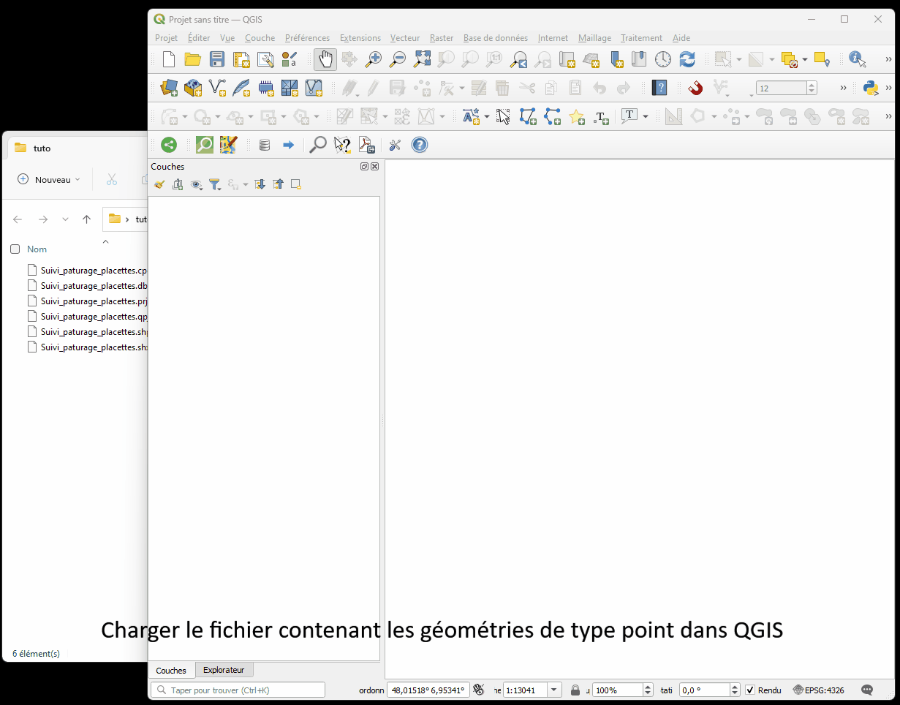

### [QGIS] Comment convertir une couche SIG au format GPX

- Cette méthode permet d'afficher les données sous la plupart des GPS, le champ renommé en `name` permet d'affecter un attribut comme nom du point dans le GPS.

